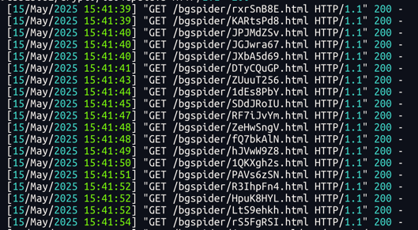

---

# 🕷️ 爬虫诱捕 Flask 项目说明文档

## 一、项目简介

本项目是一个基于 Flask 构建的**爬虫诱捕系统**，用于识别并引导非法网络爬虫行为。通过生成大量虚假页面与链接，迷惑爬虫访问，从而保护真实网站数据，并可用于记录爬虫来源等信息。

## 二、主要功能

- ✅ 自动生成随机路径（8位字母+数字）
- ✅ 使用 `faker` 模拟中文假文章内容
- ✅ 每个页面包含多个随机跳转链接，模拟真实网站结构
- ✅ 支持无限递归访问（“下一页”跳转）
- 🚨 可扩展：后续可接入 Redis 记录爬虫访问日志（预留接口）

## 三、技术栈

- Python 3.x
- [Flask](https://flask.palletsprojects.com/) - Web 框架
- [Faker](https://github.com/joke2k/faker) - 假数据生成器
- Jinja2 模板引擎（由 Flask 提供）

## 四、部署准备

### 1. 安装依赖

```bash
pip install flask faker 
```
## 五、启动服务

```bash
python app.py
```


服务默认监听在 `0.0.0.0:5000`，可通过浏览器或爬虫访问任意路径触发陷阱页面。

## 六、Nginx 配置建议（反向代理）

如果你希望将特定 User-Agent 的请求转发到此服务，请参考如下 Nginx 配置：

```nginx
location / {
    if ($http_user_agent ~* (curl|wget|python|scrapy|HttpClient|Java|bot|crawl|slurp|spider|Yandex|AhrefsBot|SemrushBot|.com|ClaudeBot|Amazon|Chrome/\*)) {
        proxy_pass http://127.0.0.1:5000;
        break;
    }

    # 正常流量继续转发至其他后端服务器
    proxy_pass http://backend_server;
}
```


## 七、未来拓展方向

- 🔍 接入 Redis 实现爬虫访问记录追踪
- 📊 添加后台管理界面查看爬虫行为数据
- 🧠 引入机器学习识别高级爬虫行为
- 📦 打包为 Docker 镜像便于部署
## 八、演示图
部分进虚假请求样例


## 九、许可证

MIT License

---

如有任何问题或需要定制开发，请联系项目维护者。欢迎提交 PR 和 Issue！

---
## 十、后续
刚部署之后请求量会缓慢上升，过几天，请求量会严重下降，不会再频繁的访问你的数据，大概率是认为你的网站没有采集价值，不会在采集
